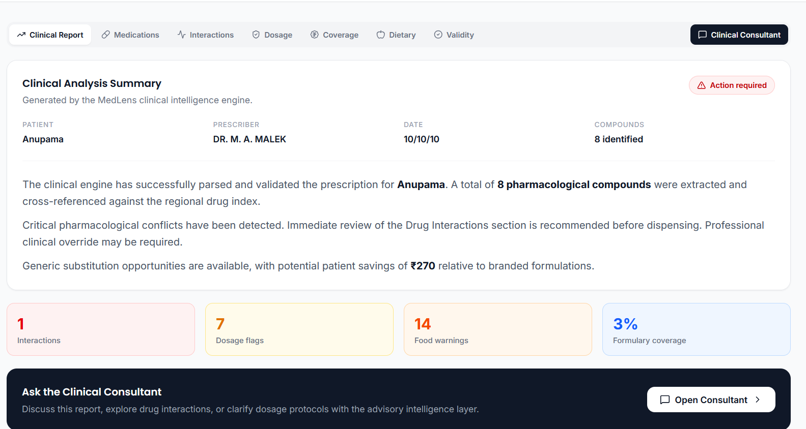
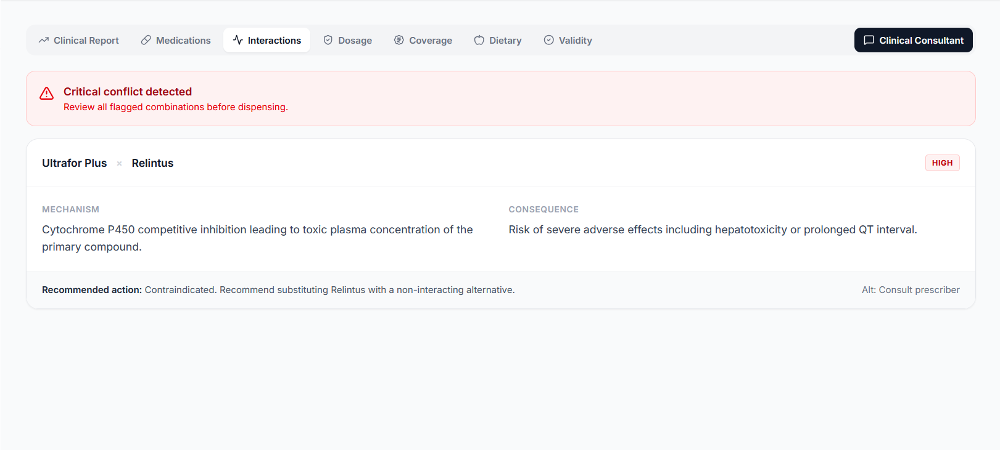
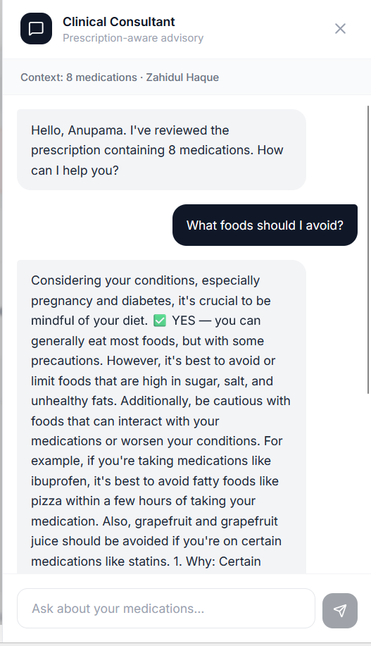
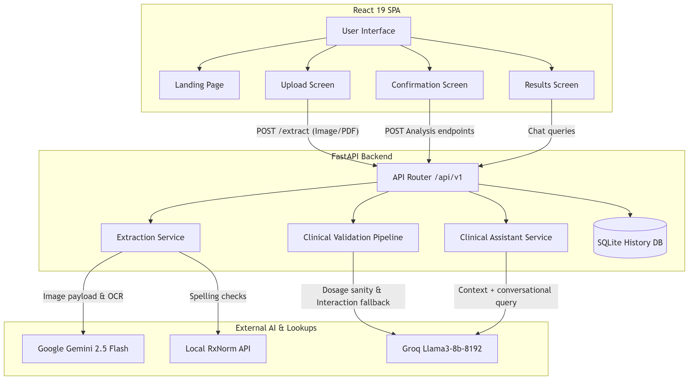
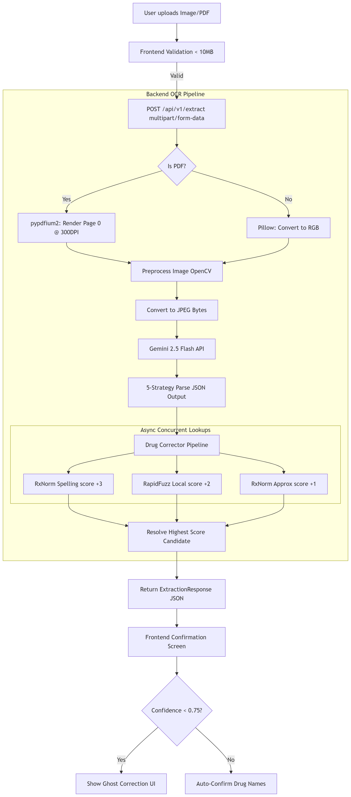
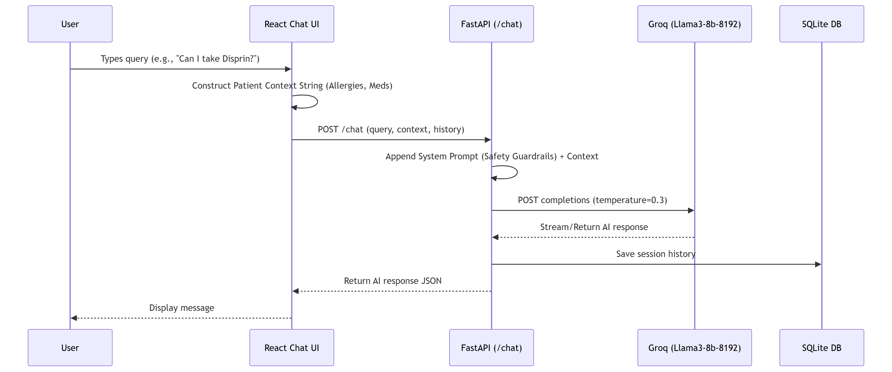

# MedLens AI

> [!IMPORTANT]
> 🚀 **Witness the Future of Clinical Safety:** See how MedLens AI turns illegible prescriptions into life-saving insights within seconds!
> 🎥 **[Watch the Full Demo on YouTube](https://youtu.be/-zR9KAvdFew)**

MedLens AI is a comprehensive, full-stack clinical decision support application designed specifically for the Indian healthcare market. It addresses the critical intersection of handwritten prescription legibility, patient medication safety, and insurance opacity that creates preventable harm every day.

Built with a modern React frontend and a fast Python backend powered by Gemini 2.5 Flash OCR, MedLens AI acts as a digital health assistant. It digitizes paper prescriptions, corrects errors, and runs a multi-layer clinical analysis pipeline—all within seconds.

---

## 🌟 The Problem We Solve

India processes an estimated 4.7 billion prescriptions per year, the vast majority of which are handwritten. This leads to three major gaps in healthcare:
1. **Prescription Illegibility:** Ambiguous handwriting, Latin abbreviations (OD, BD, TDS), and reliance on brand names make it difficult for patients to verify what they are taking.
2. **Patient Self-Medication Danger:** High rates of OTC drug use (like aspirin or antacids) combined with concurrent prescriptions often lead to clinically dangerous drug combinations.
3. **Insurance Opacity:** Patients frequently purchase expensive brand-name drugs at full price because they don't know that their insurance schemes (PMJAY, CGHS, ESI) cover generic equivalents at 50-90% lower costs.

---

## ✨ Core Capabilities

1. **AI Prescription OCR:** Uses Google's Gemini 2.5 Flash vision model to instantly digitize handwritten Indian prescriptions. It extracts patient name, doctor's credentials, drug names, dosage, frequency, and duration.
2. **Drug-Drug Interaction Detection:** Checks every combination of extracted drugs against a curated database to warn about Critical, Moderate, or Minor interactions. Includes brand-to-generic resolution.
3. **Dosage Sanity Validation:** Ensures the prescribed dose is plausible and safe given the drug type, patient context, and specific pediatric/adult rules. Falls back to Groq Llama3 for unknown drugs.
4. **Food-Drug Warnings:** Automatically retrieves and displays dietary restrictions (e.g., avoiding dairy with certain antibiotics).
5. **Smart Drug Name Correction:** Utilizes an Indian-specific drug database and fuzzy matching (via RapidFuzz & RxNorm API) to automatically correct spelling or OCR errors. Includes a Ghost Correction UI for manual overrides.
6. **Timeline Engine:** Converts medical shorthand (like *BID* or *1-0-1*) into a clear 24-hour graphical timeline for patients.
7. **Insurance & Formulary Engine:** Checks if medicines are covered by standard medical insurance and highlights potential savings by suggesting generic equivalents from Jan Aushadhi.
8. **Family Health Locker & Emergency Card:** A secure digital profile system to save medication history. It generates a publicly accessible QR-code-based medical card containing a patient's critical health data and emergency contacts.
9. **RxGuard Clinical Chatbot:** An embedded conversational AI assistant powered by Groq (llama3-8b-8192). It understands your current medication profile and provides personalized medication safety guidance.

---

## 🏗️ System Architecture & Design Philosophy

MedLens AI is built on a strict **decoupled client-server architecture**. The React Single Page Application (SPA) running in the browser has no direct knowledge of AI APIs, database connections, or drug databases. All sensitive logic lives exclusively in the FastAPI backend process.

### Frontend Deep Dive
- **React 19.2 & TypeScript 6.0:** Leverages React 19's concurrent rendering features and Suspense for smooth loading states without blocking the UI. TypeScript is configured in strict mode to ensure type safety across all clinical data components.
- **Vite 8.0:** Used for the development server with HMR and highly optimized production builds.
- **Tailwind CSS v4:** We built a custom enterprise clinical theme with a **Deep Navy** (`#0A1628`) and **Golden Amber** (`#F59E0B`) palette, using semantic colors for safety badges (critical, moderate, safe).
- **React Router v7:** Handles SPA routing between the upload wizard, the dashboard, profile management, and public emergency cards.

### Backend Deep Dive
- **FastAPI 0.111 & Uvicorn 0.29:** An async-first backend allowing multiple concurrent external API calls without blocking. All API responses follow strict Pydantic v2 schemas.
- **SQLite & SQLAlchemy ORM:** A lightweight, file-based SQL database for storing prescription history, user profiles, and chat sessions with zero configuration needed.
- **AI Integrations:**
  - **Google Gemini 2.5 Flash:** Chosen for its speed (sub-2-second OCR response) and cost-effectiveness. Processes image payloads to extract structured JSON data.
  - **Groq (llama3-8b-8192):** Used for low-latency dosage validation fallbacks, interaction enrichment, and the RxGuard conversational assistant.
- **Resilient Error Handling:** The application never blocks the clinical flow due to an AI failure. Fallbacks are built-in for every service.

---

## 📸 Screenshots

We have designed a clean, intuitive, and professional UI tailored for both patients and pharmacists. Place your screenshot files in the `screenshots` folder and name them accordingly.

### Clinical Report Dashboard
*(Upload your clinical report screenshot here)*


### Drug Interaction Alerts
*(Upload your drug interaction screenshot here)*


### RxGuard Clinical Chatbot
*(Upload your chatbot screenshot here)*


---

## 📊 Architecture Diagrams

We have documented the system flows to give a clear understanding of the backend and AI integration processes. Place your diagram PNG files in the `architecture` folder and name them accordingly.

### Overall System Architecture
*(Upload your overall system architecture diagram here)*


### OCR & Extraction Pipeline
*(Upload your OCR pipeline diagram here)*


### RxGuard Chatbot Architecture
*(Upload your chatbot architecture diagram here)*


---

## 🚀 Getting Started

Follow these steps to run MedLens AI locally:

### 1. Clone the repository
```bash
git clone https://github.com/your-username/MedLens.git
cd MedLens
```

### 2. Backend Setup
Navigate to the `backend` folder, install dependencies, and start the server:
```bash
cd backend
python -m venv venv
# On Windows:
venv\Scripts\activate
# On Mac/Linux:
source venv/bin/activate

pip install -r requirements.txt
cp .env.example .env  # Add your GEMINI_API_KEY and GROQ_API_KEY
uvicorn app.main:app --reload --host 0.0.0.0 --port 8000
```

### 3. Frontend Setup
Open a new terminal, navigate to the `frontend` folder, install dependencies, and start the Vite dev server:
```bash
cd frontend
npm install
npm run dev
```
The frontend will be available at `http://localhost:5173`.
